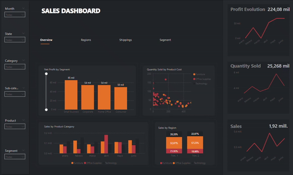

# :bar_chart: Sales Dashboard

En este proyecto he creado un panel de ventas con la herramienta de visualización y análisis interactivo de Microsoft, **Power BI**

### :construction_worker: Elaboración

Para mi primer dashboard con **Power BI** he buscado un dataset de cerca de dos mil registros con una única tabla en la que aparecían transacciones de ventas de una tienda, beneficio neto y algunos detalles de los envíos separados por región y estados dentro de los Estados Unidos de América. 
El panel se compone de cuatro pestañas en total: 

  · La primera *Overview* en la que aparece un resumen de todo
  · *Region* en la que tenemos el dato seccionado según las cuatro regiones: Central, West, East, South
  · *Shipping* donde aparece detalle de los envíos
  · *Segment* donde se divide el dato según el segmento de cliente al que pertenece

La primera tabla tiene más detalle, mientras que las siguientes son más breves por el dato tan limitado que tenemos. 

### :tv: Preview

## :wrench: Built With

* [Power BI Desktop](https://powerbi.microsoft.com/es-es/desktop/) - Herramienta de Visualización

## :star2: Authors

* **Lili Casanova** - 2024
